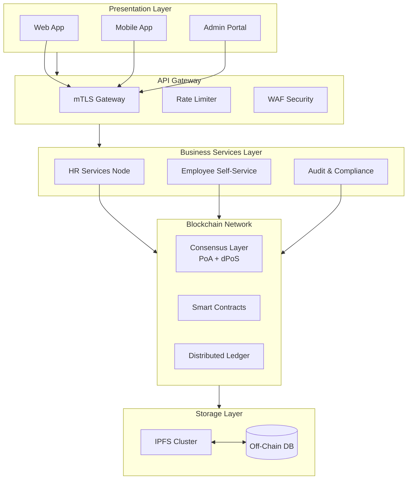
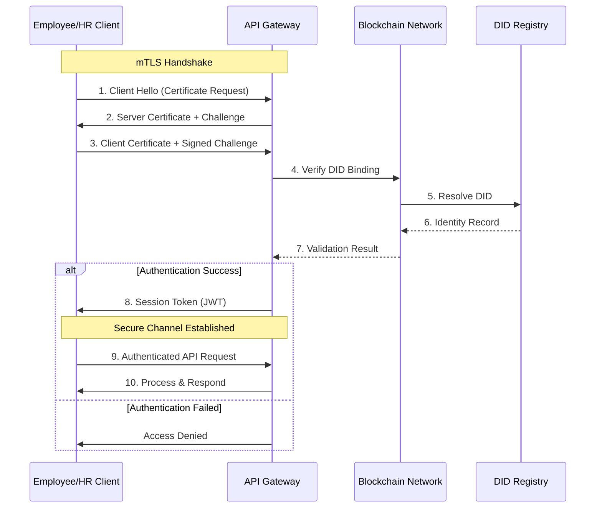
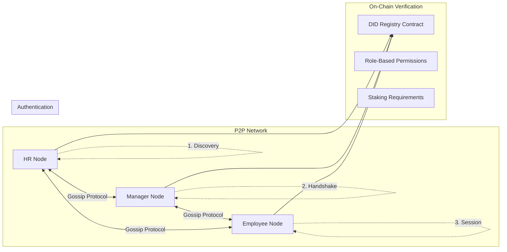
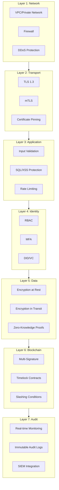
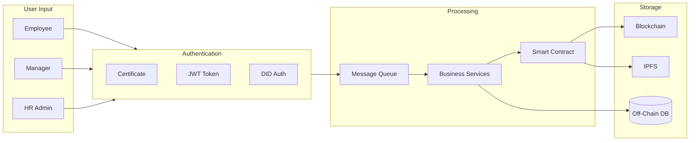
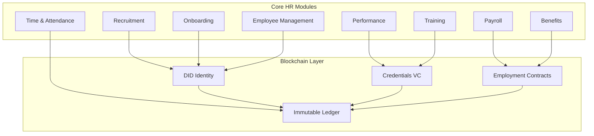
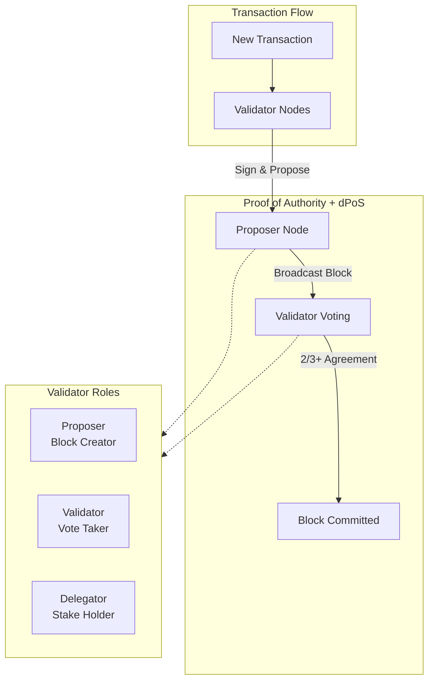

# D-HRS Architecture Diagrams

> These diagrams can be rendered in markdown viewers that support Mermaid.js (GitHub, VS Code, Notion, etc.)

---

## Diagram 1: High-Level Architecture



---

## Diagram 2: Mutual Authentication Flow



---

## Diagram 3: Node-to-Node Authentication



---

## Diagram 4: Security Layers



---

## Diagram 5: Data Flow



---

## Diagram 6: HR Module Integration



---

## Diagram 7: Consensus Mechanism



---

## ASCII Diagram 1: System Overview

```
+-----------------------------------------------------------------------------+
|                              D-HRS ECOSYSTEM                                 |
+-----------------------------------------------------------------------------+
|                                                                              |
|    +---------+     +---------+     +---------+     +---------+               |
|    |   Web   |     | Mobile  |     |  Admin  |     |   API   |               |
|    |   App   |     |  App    |     |   UI    |     | Portal  |               |
|    +----+----+     +----+----+     +----+----+     +----+----+               |
|         |               |               |               |                   |
|         +---------------+---------------+---------------+                   |
|                                 |                                             |
|                          +------+------+                                      |
|                          |  API GW +   |                                      |
|                          |    mTLS     |                                      |
|                          +------+------+                                      |
|                                 |                                             |
|         +-----------------------+-----------------------+                    |
|         |                       |                       |                    |
|  +------+------+       +-------+-------+      +--------+-----+              |
|  | HR Services |       | Employee Self |      |    Audit     |              |
|  |    Node     |       |    Service    |      |  Compliance  |              |
|  +------+------+       +-------+-------+      +------+------+              |
|         |                      |                      |                      |
+---------+----------------------+----------------------+----------------------+
|         |                      |                      |                      |
|         v                      v                      v                      |
|  +---------------------------------------------------------------------+    |
|  |                    BLOCKCHAIN NETWORK                               |    |
| -+   |  +------------ +-------------+   +-------------+               |    |
|  |  |  Consensus  |<->|   Smart     |<->| Distributed |               |    |
|  |  |   Layer     |   |  Contracts  |   |   Ledger    |               |    |
|  |  |  PoA+dPoS   |   |             |   |             |               |    |
|  |  +-------------+   +-------------+   +-------------+               |    |
|  +---------------------------------------------------------------------+    |
|                                 |                                             |
|                                 v                                             |
|  +---------------------------------------------------------------------+    |
|  |                       STORAGE LAYER                                 |    |
|  |              +-------------+    +-------------+                    |    |
|  |              |   IPFS      |<-->|  Off-Chain  |                    |    |
|  |              |  Cluster    |    |     DB      |                    |    |
|  |              +-------------+    +-------------+                    |    |
|  +---------------------------------------------------------------------+    |
|                                                                              |
+-----------------------------------------------------------------------------+
```

---

## ASCII Diagram 2: Mutual Authentication

```
+-----------------------------------------------------------------------------+
|                        MUTUAL AUTHENTICATION (mTLS)                         |
+-----------------------------------------------------------------------------+
|                                                                              |
|   CLIENT                                                          SERVER      |
|  +--------------+                                              +----------+   |
|  |  Employee/  |                                              |  API     |   |
|  |  HR Wallet  |                                              | Gateway  |   |
|  +------+-------+                                              +----+-----+   |
|         |                                                       |               |
|         |  1. Client Hello (Supported Ciphers)                  |               |
|         +----------------------------------------------------->|               |
|         |                                                       |               |
|         |  2. Server Hello + Certificate + Challenge           |               |
|         |<------------------------------------------------------|               |
|         |                                                       |               |
|         |  3. Client Certificate + Signed Challenge            |               |
|         +----------------------------------------------------->|               |
|         |                                                       |               |
|         |                         +-------------------------+   |               |
|         |                         |  Verify:                |   |               |
|         |                         |  - CA Signature        |   |               |
|         |                         |  - Not Expired         |   |               |
|         |                         |  - DID Binding         |-->|               |
|         |                         |  - Employment Status   |   |               |
|         |                         +-------------------------+   |               |
|         |                                                       |               |
|         |  4. Session Keys + Finished (Encrypted)              |               |
|         |<------------------------------------------------------|               |
|         |                                                       |               |
|         ==========================mTLS ESTABLISHED=====================       |
|         |                                                       |               |
|         |  5. Authenticated Request (JWT + mTLS)                |               |
|         +----------------------------------------------------->|               |
|         |                                                       |               |
|         |  6. Verify & Process                                  |               |
|         |                                    +-------------+   |               |
|         |                                    |  Blockchain |-->|               |
|         |                                    |   Query     |   |               |
|         |                                    +-------------+   |               |
|         |                                                       |               |
|         |  7. Response                                          |               |
|         |<------------------------------------------------------+               |
|                                                                              |
+-----------------------------------------------------------------------------+
```

---

## ASCII Diagram 3: Security Architecture

```
+-----------------------------------------------------------------------------+
|                      DEFENSE IN DEPTH - 7 LAYERS                            |
+-----------------------------------------------------------------------------+
|                                                                              |
|  Layer 7: MONITORING & AUDIT                                                 |
|  +-------------------------------------------------------------------------+ |
|  |  [Real-time Anomaly Detection]  [Immutable Audit Logs]                 | |
|  |  [SIEM Integration]  [Automated Alerting]  [Compliance Reports]          | |
|  +-------------------------------------------------------------------------+ |
|                                    ^                                         |
|  Layer 6: BLOCKCHAIN SECURITY   |                                          |
|  +-------------------------------------------------------------------------+ |
|  |  [Multi-Signature]  [Timelock Contracts]  [Slashing]                    | |
|  |  [Hash Locking]  [On-Chain Governance]                                  | |
|  +-------------------------------------------------------------------------+ |
|                                    ^                                         |
|  Layer 5: DATA SECURITY         |                                          |
|  +-------------------------------------------------------------------------+ |
|  |  [AES-256 at Rest]  [Field-Level Encryption]                           | |
|  |  [Zero-Knowledge Proofs]  [Data Segmentation]                          | |
|  +-------------------------------------------------------------------------+ |
|                                    ^                                         |
|  Layer 4: IDENTITY & ACCESS     |                                          |
|  +-------------------------------------------------------------------------+ |
|  |  [RBAC]  [ABAC]  [MFA]  [Self-Sovereign Identity]                      | |
|  |  [DID/VC]  [Proof of Authority]                                       | |
|  +-------------------------------------------------------------------------+ |
|                                    ^                                         |
|  Layer 3: APPLICATION SECURITY   |                                          |
|  +-------------------------------------------------------------------------+ |
|  |  [Input Validation]  [SQL Injection Prevention]                         | |
|  |  [XSS/CSRF Protection]  [Rate Limiting]  [API Key Rotation]           | |
|  +-------------------------------------------------------------------------+ |
|                                    ^                                         |
|  Layer 2: TRANSPORT SECURITY    |                                          |
|  +-------------------------------------------------------------------------+ |
|  |  [TLS 1.3]  [Mutual TLS (mTLS)]  [Certificate Pinning]                  | |
|  |  [HSTS]                                                            | |
|  +-------------------------------------------------------------------------+ |
|                                    ^                                         |
|  Layer 1: NETWORK SECURITY       |                                          |
|  +-------------------------------------------------------------------------+ |
|  |  [VPC/Private Network]  [Firewall]  [DDoS Protection]                  | |
|  |  [Network Segmentation]                                       | |
|  +-------------------------------------------------------------------------+ |
|                                                                              |
|  +-------------------------------------------------------------------------+ |
|  |                    SECURITY INFRASTRUCTURE                               | |
|  |   +--------------+    +--------------+    +--------------+             | |
|  |   |  HSM Cluster |    | Secret Mgr   |    | Audit Chain  |             | |
|  |   | (Key Storage)|    |   (Vault)    |    |(Immutable)   |             | |
|  |   +--------------+    +--------------+    +--------------+             | |
|  +-------------------------------------------------------------------------+ |
+-----------------------------------------------------------------------------+
```

---

## ASCII Diagram 4: Data Flow

```
+-----------------------------------------------------------------------------+
|                           DATA FLOW ARCHITECTURE                             |
+-----------------------------------------------------------------------------+
|                                                                              |
|  +---------+    +---------+    +---------+    +---------+                      |
|  |Employee |    |Manager  |    |   HR    |    |External |                      |
|  | Client  |    | Client  |    |  Admin  |    |Systems  |                      |
|  +----+----+    +----+----+    +----+----+    +----+----+                      |
|       |              |              |              |                            |
|       |   +----------+----------+----------+----------+                 |
|       |   |          |              |              |          |                 |
|       v   v          v              v              v          v                 |
|  +---------------------------------------------------------------------+    |
|  |                   AUTHENTICATION GATEWAY                             |    |
|  |   +---------+  +---------+  +---------+  +---------+          |            |
|  |   |   mTLS  |  |   JWT   |  |   DID   |  |  OAuth  |          |            |
|  |   | Handler |  |Validator|  |Resolver |  |Provider |          |            |
|  |   +----+----+  +----+----+  +----+----+  +----+----+          |            |
|  +---------+-------------+-------------+-------------+---------------+        |
|           |             |             |             |                            |
|           v             v             v             v                            |
|  +---------------------------------------------------------------------+    |
|  |                    BUSINESS SERVICES                                 |    |
|  |   +-----------------------------------------------------------+   |            |
|  |   |  +--------+  +--------+  +--------+  +--------+        |   |            |
|  |   |  |Employee|  |Recruit |  |Payroll |  |Benefits|        |   |            |
|  |   |  |Service |  |Service |  |Service |  |Service |        |   |            |
|  |   |  +----+---+  +----+---+  +----+---+  +----+---+        |   |            |
|  |   +-------+----------+----------+----------+--------+----------+   |            |
|  |           |          |          |          |                  |            |
|  |           v          v          v          v                  |            |
|  |   +-----------------------------------------------------------+ |            |
|  |   |              BLOCKCHAIN INTERFACE                        | |            |
|  |   |   +--------+  +--------+  +--------+  +--------+        | |            |
|  |   |   |   Tx   |  |Contract|  | Merkle |  |  DID   |        | |            |
|  |   |   |Builder |  | Caller |  |Verifier|  |Resolver|        | |            |
|  |   |   +----+---+  +----+---+  +----+---+  +----+---+        | |            |
|  |   +--------+-----------+-----------+-----------+------------+ |            |
|  |            |           |           |           |               |            |
|  |            v           v           v           v               |            |
|  |   +-----------------------------------------------------------+ |            |
|  |   |                    BLOCKCHAIN NETWORK                    | |            |
|  |   |    +--------+    +--------+    +--------+    +-------+  | |            |
|  |   |    | Node 1 |<->| Node 2 |<->| Node 3 |<->|Node N |  | |            |
|  |   |    |(Valid) |    |(Valid) |    |(Valid) |    |(Valid)|  | |            |
|  |   |    +---+----+    +---+----+    +---+----+    +---+----+  | |            |
|  |   |        |            |            |            |        | |            |
|  |   |        +------------+------------+------------+        | |            |
|  |   |                         |                               | |            |
|  |   |                    Consensus                            | |            |
|  |   |                         |                               | |            |
|  |   |                         v                               | |            |
|  |   |   +-----------------------------------------------+     | |            |
|  |   |   |         DISTRIBUTED LEDGER                    |     | |            |
|  |   |   |   +----------------------------------------+  |     | |            |
|  |   |   |   | Block N: Employee Records, Credentials |  |     | |            |
|  |   |   |   | Block N-1: ...                         |  |     | |            |
|  |   |   |   | Block N-2: ...                         |  |     | |            |
|  |   |   |   +----------------------------------------+  |     | |            |
|  |   |   +-----------------------------------------------+     | |            |
|  |   +-----------------------------------------------------------+ |            |
|  +---------------------------------------------------------------------+    |
|                                    |                                             |
|                                    v                                             |
|  +---------------------------------------------------------------------+    |
|  |                         STORAGE LAYER                                 |    |
|  |              +-------------+           +-------------+                    |    |
|  |              |    IPFS    |<---------->|  PostgreSQL |                    |    |
|  |              |  (Files)   |           |  (Data)     |                    |    |
|  |              +-------------+           +-------------+                    |    |
|  +---------------------------------------------------------------------+    |
|                                                                              |
+-----------------------------------------------------------------------------+
```

---

These diagrams provide visual representation of the D-HRS architecture and can be rendered in markdown viewers that support Mermaid.js (GitHub, VS Code, Notion, Obsidian, GitLab, etc.)
