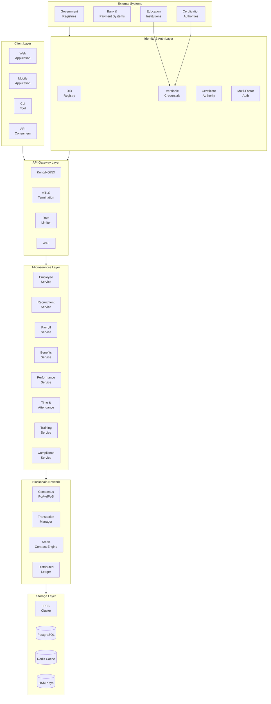
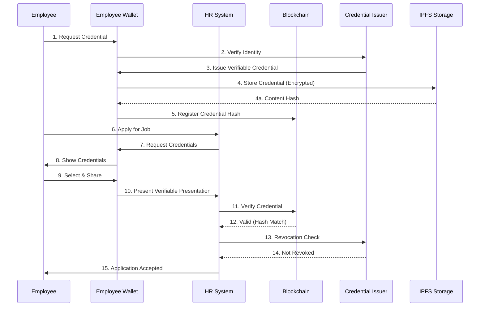
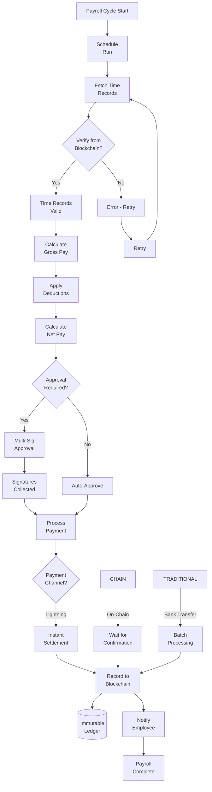
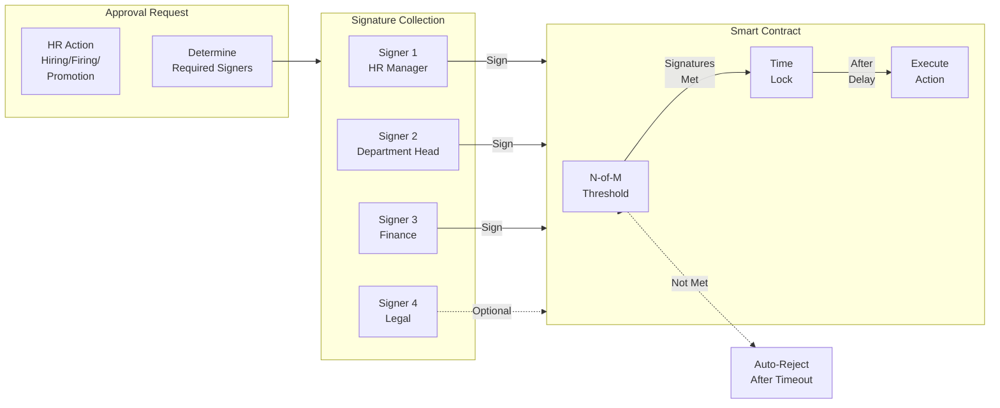
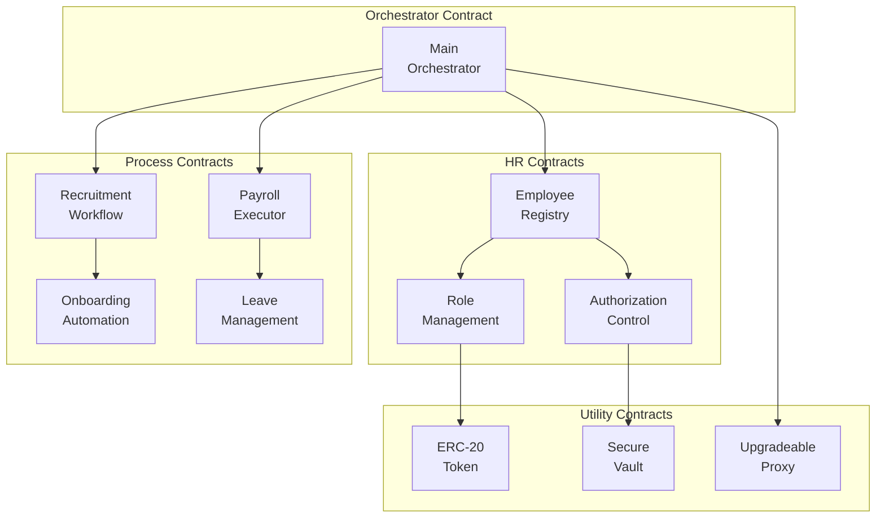
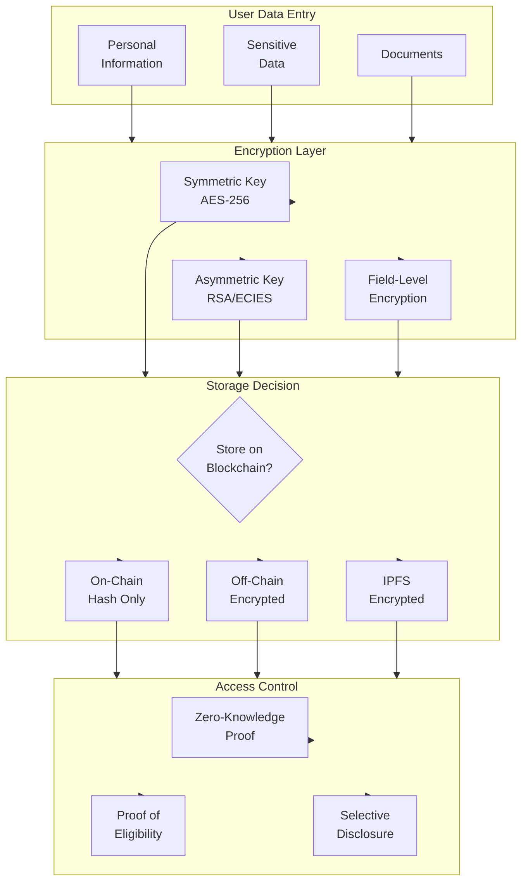
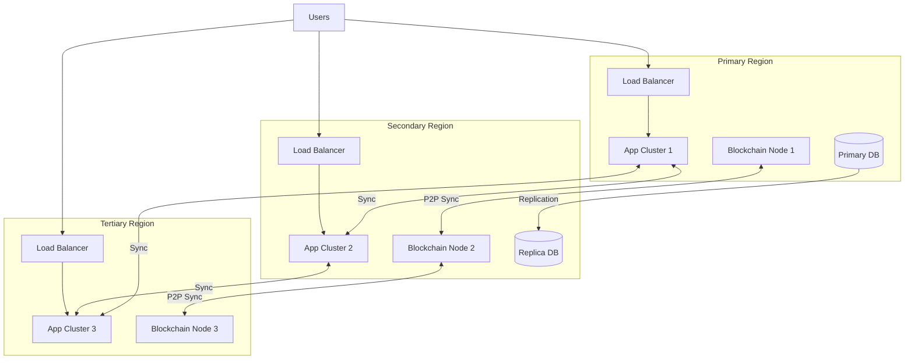
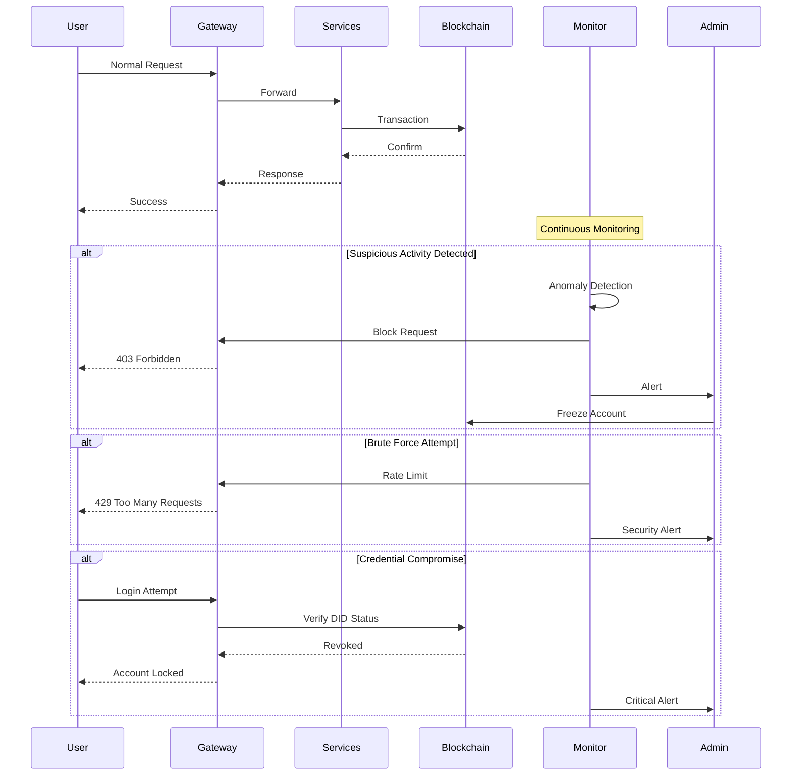
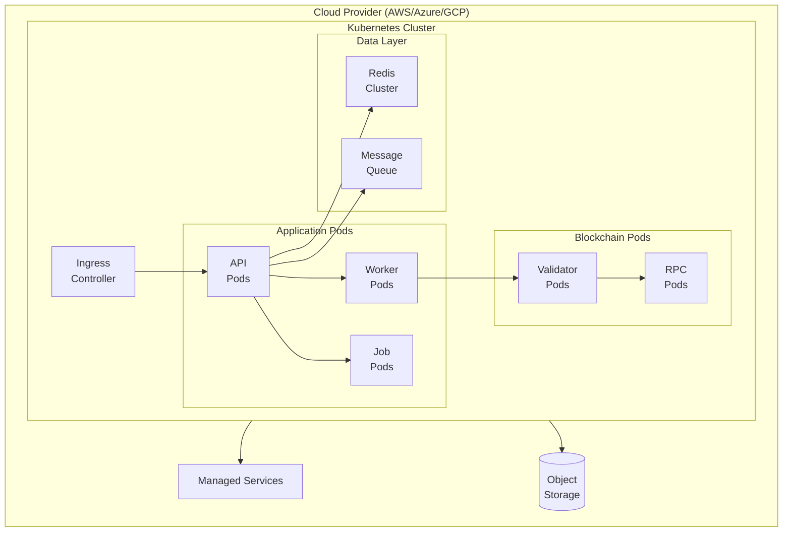
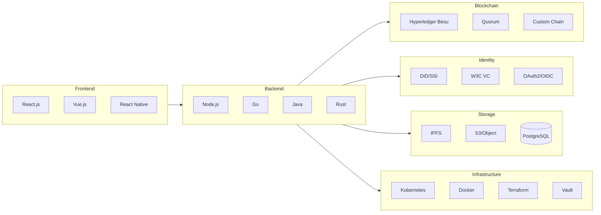

# D-HRS Extended Diagrams & Technical Details

> Additional diagrams for comprehensive of the visualization Decentralized HR System

---

## 1. Complete System Architecture with All Components



---

## 2. Employee Lifecycle on Blockchain

```mermaid
state    [*]Diagram-v2
 --> Candidate
    
    Candidate --> Applied: Submit Application
    Applied --> Screening: Pass Screening
    Screening --> Interview: Schedule Interview
    Interview --> Offer: Pass Interview
    Offer --> Onboarding: Accept Offer
    Onboarding --> Active: Complete Onboarding
    
    Active --> Promoted: Promotion
    Active --> Transfer: Internal Transfer
    Active --> Training: Skills Development
    Active --> Review: Performance Review
    Active --> Leave: Request Leave
    
    Promoted --> Active
    Transfer --> Active
    Training --> Active
    Review --> Active
    
    Leave --> Active: Return
    Leave --> Terminated: Resign/Fired
    
    Terminated --> [*]
    
    note right of Candidate: Stored as<br/>VC Credential
    note right of Active: Employment<br/>UTXO on Chain
    note right of Terminated: Final Settlement<br/>Smart Contract
```

---

## 3. Credential Verification Flow



---

## 4. Payroll Processing Flow



---

## 5. Multi-Signature Approval Process



---

## 6. Smart Contract Architecture



---

## 7. Data Privacy & Encryption Architecture



---

## 8. Disaster Recovery & High Availability



---

## 9. API Endpoints Structure

```mermaid
graph LR
    subgraph PUBLIC["Public API"]
        AUTH[/auth/**]
        PUBINFO[/public/**]
    end
    
    subgraph PRIVATE["Private API"]
        EMP[/api/employees/**]
        RECRUIT[/api/recruit/**]
        PAYROLL[/api/payroll/**]
        BENEFI[/api/benefits/**]
        PERF[/api/performance/**]
        TIME[/api/time/**]
    end
    
    subgraph ADMIN["Admin API"]
        SYS[/admin/**]
        CONFIG[/config/**]
        AUDIT[/audit/**]
    end
    
    subgraph BLOCKCHAIN["Blockchain API"]
        TX[/blockchain/tx/**]
        CONTRACT[/blockchain/contracts/**]
        CONTRACT --> TX
    end
    
    PUBLIC --> GATEWAY
    PRIVATE --> GATEWAY
    ADMIN --> GATEWAY
    BLOCKCHAIN --> GATEWAY
    
    GATEWAY --> RBAC{RBAC<br/>Check}
    RBAC -->|Allow| PROCESS
    RBAC -->|Deny| REJECT[401/403]
```

---

## 10. Complete ASCII Architecture

```
+=================================================================================+
|                        D-HRS COMPLETE ARCHITECTURE                              |
+=================================================================================+
|                                                                                  |
|  +=======================+                                                       |
|  |    EXTERNAL SYSTEMS  |                                                       |
|  +=======================+                                                       |
|    |         |        |        |         |                                        |
|    v         v        v        v         v                                        |
| +-------+ +-------+ +-------+ +-------+ +-------+                               |
| |Government| | Bank | | Edu   | |Cert   | | Other |                               |
| |Registries| |Systems| | Inst. | |Authority| | APIs |                               |
| +-------+ +-------+ +-------+ +-------+ +-------+                               |
|                                                                                  |
+=================================================================================+
|                                                                                  |
|  +=======================+                                                       |
|  |    CLIENT LAYER       |                                                       |
|  +=======================+                                                       |
|    |         |        |        |                                                  |
|    v         v        v        v                                                  |
| +-------+ +-------+ +-------+ +-------+                                          |
| |  Web  | |Mobile | |  CLI  | |  API  |                                          |
| |  App  | |  App  | |  Tool  | |Consumers|                                         |
| +-------+ +-------+ +-------+ +-------+                                          |
|                                                                                  |
+=================================================================================+
|                                    |                                             |
|                         mTLS + JWT + OAuth                                       |
|                                    v                                             |
|  +=======================+                                                       |
|  |   IDENTITY & AUTH    |                                                       |
|  +=======================+                                                       |
|    +---------+  +---------+  +---------+  +---------+                            |
|    |   DID   |  |   VC    |  |   CA    |  |   MFA   |                            |
|    | Registry|  | Verifier|  |         |  |         |                            |
|    +---------+  +---------+  +---------+  +---------+                            |
|                                                                                  |
+=================================================================================+
|                                    |                                             |
|                                    v                                             |
|  +=======================+                                                       |
|  |    API GATEWAY       |                                                       |
|  +=======================+                                                       |
|    +---------+  +---------+  +---------+  +---------+                            |
|    |  Kong/  |  |   mTLS  |  |  Rate   |  |   WAF   |                            |
|    | NGINX   |  |Terminal |  | Limiter |  |         |                            |
|    +---------+  +---------+  +---------+  +---------+                            |
|                                                                                  |
+=================================================================================+
|                                    |                                             |
|                                    v                                             |
|  +=======================+                                                       |
|  |  MICROSERVICES       |                                                       |
|  +=======================+                                                       |
|    |    |    |    |    |    |    |    |    |                                     |
|    v    v    v    v    v    v    v    v    v                                     |
| +-----+-----+-----+-----+-----+-----+-----+-----+                               |
| | EMP | REC | PAY | BEN |PERF| TIME|TRAIN|COMP |                               |
| | Svc | Svc | Svc | Svc | Svc| Svc| Svc | Svc |                               |
| +-----+-----+-----+-----+-----+-----+-----+-----+                               |
|                                                                                  |
+=================================================================================+
|                                    |                                             |
|                                    v                                             |
|  +=======================+                                                       |
|  |  BLOCKCHAIN NETWORK   |                                                       |
|  +=======================+                                                       |
|    |                                                        |                   |
|    v                                                        v                   |
| +----------------------------------+    +----------------------------------+     |
| |      CONSENSUS LAYER             |    |     SMART CONTRACT LAYER         |     |
| | +--------+ +--------+ +--------+ |    | +--------+ +--------+ +--------+ |     |
| | |Validator| |Validator| |Validator| |    | |Employee| |Payroll| |Benefits| |     |
| | | Node 1 | | Node 2 | | Node N | |    | |Contract| |Contract| |Contract| |     |
| | +--------+ +--------+ +--------+ |    | +--------+ +--------+ +--------+ |     |
| +----------------------------------+    +----------------------------------+     |
|                                                                                  |
| +======================================================================+        |
| |                    DISTRIBUTED LEDGER                               |        |
| |  +-------------------------------------------------------------+   |        |
| |  |  Block N: Employee Records, Credentials, Payroll, TXs     |   |        |
| |  |  Block N-1: ...                                             |   |        |
| |  |  Block N-2: ...                                             |   |        |
| |  +-------------------------------------------------------------+   |        |
| +======================================================================+        |
|                                                                                  |
+=================================================================================+
|                                    |                                             |
|                                    v                                             |
|  +=======================+                                                       |
|  |    STORAGE LAYER     |                                                       |
|  +=======================+                                                       |
|    +---------+  +---------+  +---------+  +---------+                            |
|    |  IPFS   |  |PostgreSQL|  |  Redis  |  |   HSM   |                            |
|    |Cluster  |  |   DB    |  |  Cache  |  | (Keys)  |                            |
|    +---------+  +---------+  +---------+  +---------+                            |
|                                                                                  |
+=================================================================================+
```

---

## 11. Security Event Timeline



---

## 12. Deployment Architecture



---

## 13. Technology Stack Summary Diagram



---

This completes the comprehensive D-HRS architecture with visual diagrams covering:
1. Complete system architecture
2. Employee lifecycle state machine
3. Credential verification flow
4. Payroll processing
5. Multi-signature approvals
6. Smart contract structure
7. Data privacy architecture
8. High availability design
9. API structure
10. Complete ASCII overview
11. Security event handling
12. Deployment architecture
13. Technology stack
