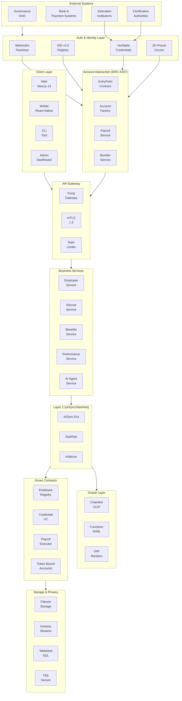
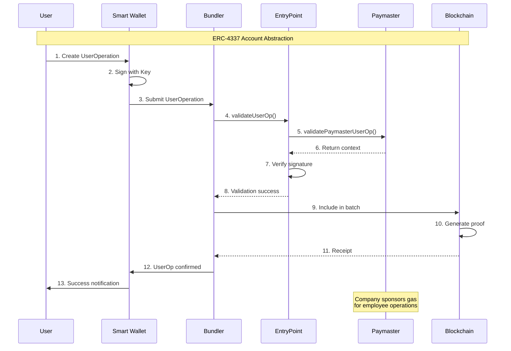
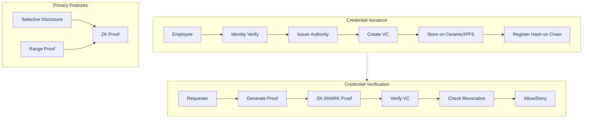
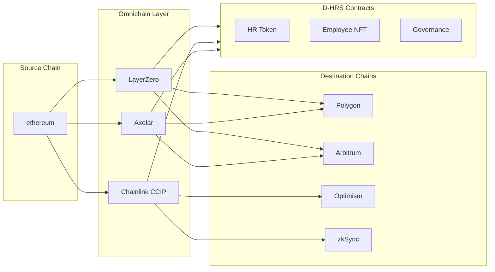
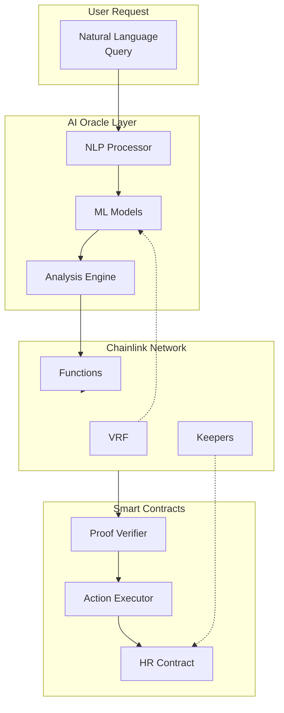
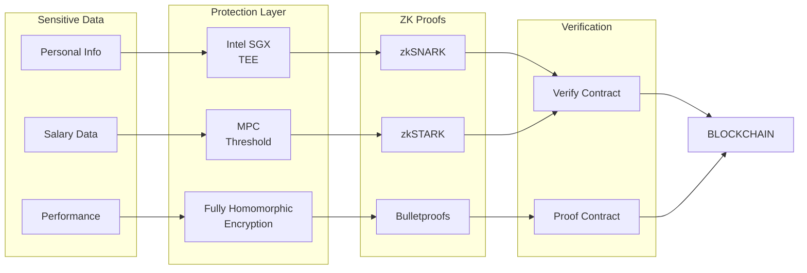
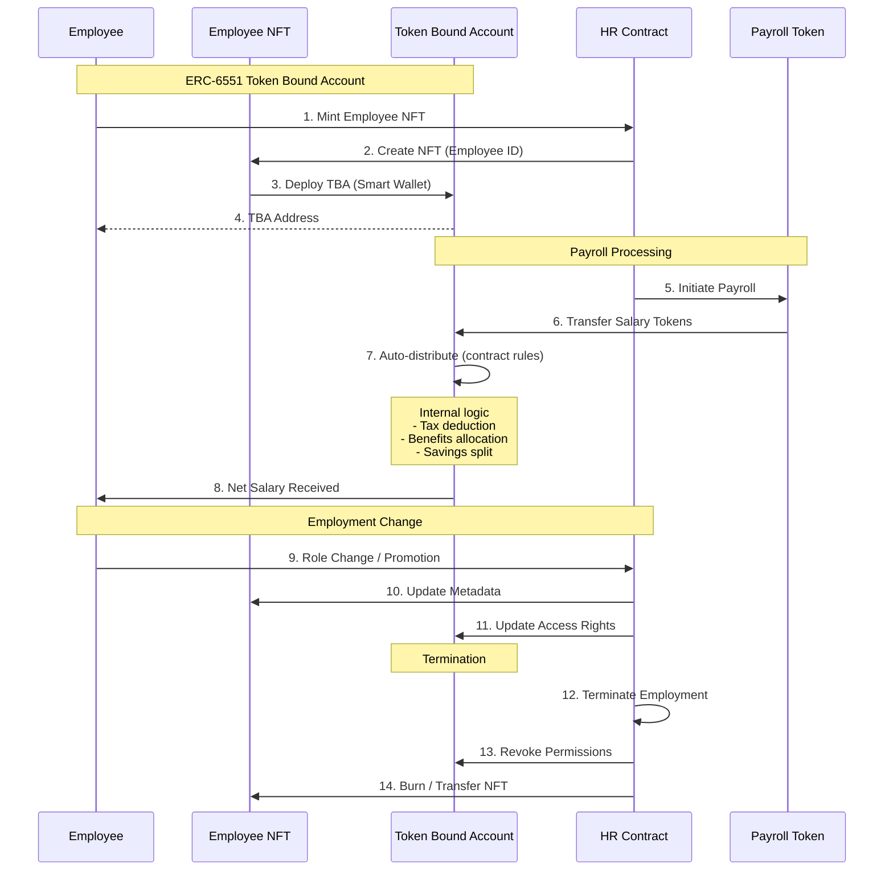
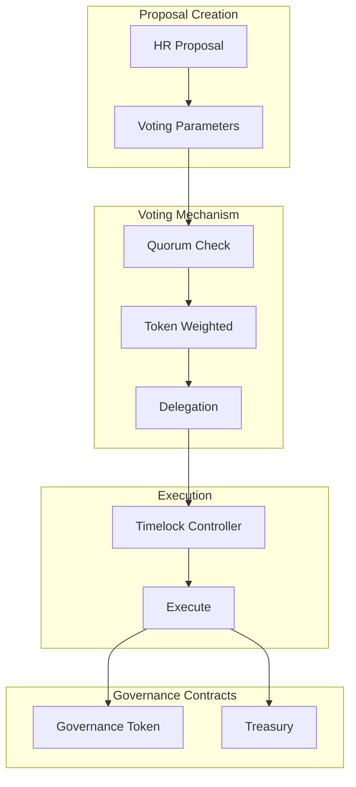
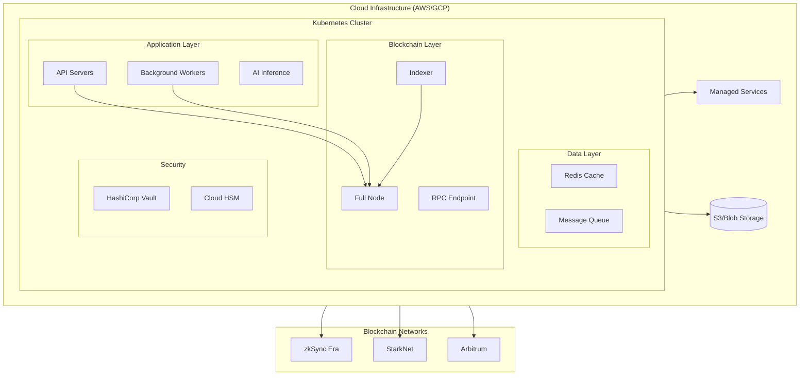
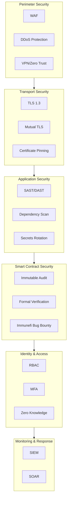

# D-HRS v2.0 Enhanced Architecture Diagrams

> Visual diagrams with Mermaid.js - Render in GitHub, VS Code, Notion, etc.

---

## 1. Complete System Architecture (Mermaid)



---

## 2. Account Abstraction Flow



---

## 3. Identity & Credential Flow



---

## 4. Multi-Chain Architecture



---

## 5. AI Integration Architecture



---

## 6. Privacy Architecture



---

## 7. Token Bound Account Flow



---

## 8. Governance Architecture



---

## 9. Deployment Architecture



---

## 10. Security Architecture



---

## 11. Enhanced ASCII Architecture Diagram

```
+========================================================================================================+
|                                  D-HRS v2.0 SYSTEM ARCHITECTURE                                       |
+========================================================================================================+
|                                                                                                        |
|  +======================+     +======================+     +======================+                      |
|  |   CLIENT LAYER      |     |   EXTERNAL SYSTEMS  |     |   AI SYSTEMS        |                      |
|  +======================+     +======================+     +======================+                      |
|  |  +----+  +----+     |     |  +----+  +----+     |     |  +----+  +----+     |                      |
|  |  |Web |  |App |     |     |  |Gov |  |Bank|     |     |  |AI  |  |ML  |     |                      |
|  |  |Next|  |React      |     |  |    |  |    |     |     |  |Chat|  |Models    |                      |
|  |  +----+  +----+     |     |  +----+  +----+     |     |  +----+  +----+     |                      |
|  +==========+==========+     +==========+==========+     +==========+==========+                      |
|                 |                       |                       |                                        |
|                 +-----------------------+-----------------------+                                        |
|                                             |                                                                |
|                                             ▼                                                                |
|  +====================================================================================================+   |
|  |                                    AUTHENTICATION & IDENTITY                                          |   |
|  +====================================================================================================+   |
|  |                                                                                                        |   |
|  |  ┌──────────────────────────────────────────────────────────────────────────────────────────────┐    |   |
|  |  │                           ACCOUNT ABSTRACTION (ERC-4337)                                       │    |   |
|  |  │   ┌──────────┐    ┌──────────┐    ┌──────────┐    ┌──────────┐    ┌──────────┐             │    |   |
|  |  │   │EntryPoint│    │ Account  │    │ Paymaster│    │ Bundler │    │ Factory  │             │    |   │
|  |  │   │Contract  │    │          │    │(Gasless) │    │ Service │    │          │             │    |   |
|  |  │   └──────────┘    └──────────┘    └──────────┘    └──────────┘    └──────────┘             │    |   |
|  |  └──────────────────────────────────────────────────────────────────────────────────────────────┘    |   |
|  |                                                                                                        |   |
|  |  ┌──────────────────────────────────────────────────────────────────────────────────────────────┐    |   |
|  |  │                              IDENTITY STACK v2.0                                               │    |   |
|  |  │   ┌──────────┐    ┌──────────┐    ┌──────────┐    ┌──────────┐    ┌──────────┐             │    |   |
|  |  │   │WebAuthn │    │    DID   │    │    VC    │    │    ZKP   │    │ Social   │             │    |   |
|  |  │   │Passkeys │    │ Registry │    │ Verifier │    │  Prover  │    │ Recovery │             │    |   |
|  |  │   └──────────┘    └──────────┘    └──────────┘    └──────────┘    └──────────┘             │    |   |
|  |  └──────────────────────────────────────────────────────────────────────────────────────────────┘    |   |
|  +====================================================================================================+   |
|                                             │                                                                |
|                                             ▼                                                                |
|  +====================================================================================================+   |
|  |                                    API GATEWAY LAYER                                                  |   |
|  +====================================================================================================+   |
|  |   ┌──────────┐    ┌──────────┐    ┌──────────┐    ┌──────────┐    ┌──────────┐                       |   |
|  |   │   Kong   │    │   mTLS   │    │  Rate    │    │   Auth   │    │   WAF    │                       |   |
|  |   │ Gateway  │    │   1.3    │    │ Limiter  │    │  (JWT)   │    │          │                       |   |
|  |   └──────────┘    └──────────┘    └──────────┘    └──────────┘    └──────────┘                       |   |
|  +====================================================================================================+   |
|                                             │                                                                |
|                                             ▼                                                                |
|  +====================================================================================================+   |
|  |                                 BUSINESS SERVICES LAYER                                               |   |
|  +====================================================================================================+   |
|  |    +--------+ +--------+ +--------+ +--------+ +--------+ +--------+ +--------+ +--------+         |   |
|  |    │Employee│ │Recruit │ │Payroll │ │Benefits│ │Performance│ │ Time  │ │  AI   │ │Notif  │         |   |
|  |    │Service │ │Service │ │Service │ │Service │ │ Service │ │Service │ │Service │ │Service │         |   |
|  |    +--------+ +--------+ +--------+ +--------+ +--------+ +--------+ +--------+ +--------+         |   |
|  +====================================================================================================+   |
|                                             │                                                                |
|                                             ▼                                                                |
|  +====================================================================================================+   |
|  |                              BLOCKCHAIN ORCHESTRATION                                                  |   |
|  +====================================================================================================+   |
|  |                                                                                                        |   |
|  |  ┌──────────────────────────────────────────────────────────────────────────────────────────────┐    |   |
|  |  │                                ORACLE LAYER                                                      │    |   |
|  |  │   ┌──────────┐    ┌──────────┐    ┌──────────┐    ┌──────────┐    ┌──────────┐             │    |   |
|  |  │   │  CCIP   │    │Functions │    │   VRF    │    │Automation│    │   DON   │             │    |   |
|  |  │   │(X-Chain)│    │  (AI/ML) │    │(Random)  │    │ (Cron)   │    │          │             │    |   |
|  |  │   └──────────┘    └──────────┘    └──────────┘    └──────────┘    └──────────┘             │    |   |
|  |  └──────────────────────────────────────────────────────────────────────────────────────────────┘    |   |
|  +====================================================================================================+   |
|                                             │                                                                |
|                                             ▼                                                                |
|  +====================================================================================================+   |
|  |                                   LAYER 2 BLOCKCHAIN                                                  |   |
|  +====================================================================================================+   |
|  |                                                                                                        |   |
|  |  ┌──────────────────────────────────────────────────────────────────────────────────────────────┐    |   |
|  |  │                               zkSync Era / StarkNet / Arbitrum                                │    |   |
|  |  │  ┌──────────────────────────────────────────────────────────────────────────────────────┐    │    │   |
|  |  │  │                                   CONSENSUS                                             │    │    │   |
|  |  │  │  ┌─────────┐  ┌─────────┐  ┌─────────┐  ┌─────────┐  ┌─────────┐  ┌─────────┐      │    │    │   |
|  |  │  │  │Validator│  │Proposer │  │Sequencer│  │Prover   │  │Batcher  │  │ Indexer │      │    │    │   |
|  |  │  │  │  (PoS)  │  │         │  │         │  │ (zkSNARK)│  │         │  │         │      │    │    │   |
|  |  │  │  └─────────┘  └─────────┘  └─────────┘  └─────────┘  └─────────┘  └─────────┘      │    │    │   |
|  |  │  └──────────────────────────────────────────────────────────────────────────────────────┘    │    │   |
|  |  │                                                                                                    |    │   |
|  |  │  ┌──────────────────────────────────────────────────────────────────────────────────────┐    │    │   |
|  |  │  │                                SMART CONTRACTS                                           │    │    │   |
|  |  │  │  ┌────────┐ ┌────────┐ ┌────────┐ ┌────────┐ ┌────────┐ ┌────────┐ ┌────────┐      │    │    │   │
|  |  │  │  │Employee│ │Credential│ │Payroll │ │Benefits│ │  TBA   │ │Govern  │ │  DID   │      │    │    │   │
|  |  │  │  │Registry│ │ Registry │ │Executor│ │  NFT   │ │Registry│ │  DAO   │ │Registry│      │    │    │   │
|  |  │  │  └────────┘ └────────┘ └────────┘ └────────┘ └────────┘ └────────┘ └────────┘      │    │    │   |
|  |  │  └──────────────────────────────────────────────────────────────────────────────────────┘    │    │   |
|  |  └──────────────────────────────────────────────────────────────────────────────────────────────┘    |   |
|  |                                                                                                        |   |
|  |  ┌──────────────────────────────────────────────────────────────────────────────────────────────┐    |   |
|  |  │                              DISTRIBUTED LEDGER                                               │    |   |
|  |  │  ┌────────────────────────────────────────────────────────────────────────────────────┐     │    │   |
|  |  │  │  Block N: Employee Records, Credentials, Payroll TXs, Governance Votes             │     │    │   |
|  |  │  │  Block N-1: ...                                                                │     │    │   |
|  |  │  │  Block N-2: ...                                                                │     │    │   |
|  |  │  │                                    Merkle Root: 0xABC... (ZK Verified)             │     │    │   |
|  |  │  └────────────────────────────────────────────────────────────────────────────────────┘     │    │   |
|  |  └──────────────────────────────────────────────────────────────────────────────────────────────┘    |   |
|  +====================================================================================================+   |
|                                             │                                                                |
|                                             ▼                                                                |
|  +====================================================================================================+   |
|  |                                STORAGE & PRIVACY LAYER                                               |   |
|  +====================================================================================================+   |
|  |   ┌──────────┐    ┌──────────┐    ┌──────────┐    ┌──────────┐    ┌──────────┐                       |   |
|  |   │ Filecoin │    │ Ceramic  │    │Tableland │    │   TEE    │    │   MPC    │                       |   |
|  |   │(Storage) │    │(Streams) │    │   (SQL)   │    │(Secure)  │    │(Threshold)│                      |   |
|  |   └──────────┘    └──────────┘    └──────────┘    └──────────┘    └──────────┘                       |   |
|  +====================================================================================================+   |
|                                                                                                        |
+========================================================================================================+
```

---

This completes the enhanced architecture diagrams with the latest Web3 technologies including:
- ERC-4337 Account Abstraction
- Layer 2 scaling (zkSync, StarkNet, Arbitrum)
- Chainlink CCIP and Functions
- Token Bound Accounts (ERC-6551)
- Zero-Knowledge Proofs
- AI Oracle integration
- Multi-chain interoperability
